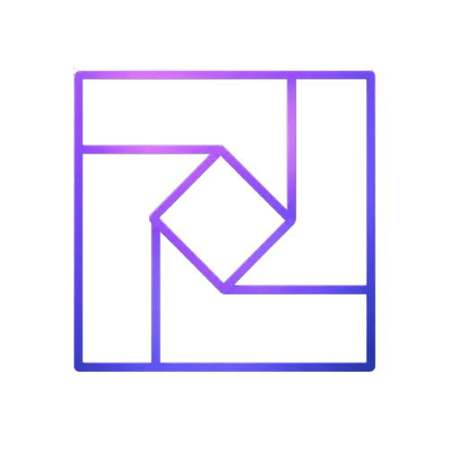

<div align="center">



# MyTake

**Rephrase any webpage in your tone — powered by Chrome's on-device AI.**

[](https://chrome.google.com/webstore)
[](https://developer.chrome.com/docs/extensions/mv3/intro/)
[](LICENSE)
[](PRIVACY.md)

</div>

---

## What is MyTake?

MyTake is a Chrome extension that rewrites every text node on a webpage in a mood of your choosing — Cherry (warm & uplifting), Brutal (blunt & straight), Academic (formal & precise), Poetic, Casual, and more. It runs entirely on **Chrome's built-in Gemini Nano** via the experimental Prompt API, meaning no text leaves your browser and no external AI service is contacted.

Switch the mood on any article, news page, or documentation and read it in the voice you actually want.

---

## Screenshots

> _Add screenshots here — popup UI, a before/after on an article, custom mood creator_

---

## Features

| Feature | Description |
|---|---|
| **7 built-in moods** | Standard · Cherry · Honest · Brutally Honest · Academic · Casual · Poetic |
| **Custom moods** | Create unlimited moods with a name and a freeform style description |
| **Intensity slider** | Three levels — Subtle, Moderate, Extreme — tune how dramatically text is transformed |
| **Auto / Manual mode** | Auto continuously rewrites new text as the page loads; Manual triggers on demand |
| **Pause & Restart** | Pause mid-run without losing progress; Restart wipes rephrased text and starts fresh |
| **Translation cache** | Up to 2,000 rephrasings are cached locally so switching back to a mood is instant |
| **Dark & Light theme** | Toggle between themes from the popup header |
| **100% on-device** | All inference runs inside Chrome via the Prompt API — zero network requests for AI |
| **Zero data collection** | No analytics, no telemetry, no external servers |

---

## Requirements

- **Google Chrome** version 127 or later (Chrome Dev or Canary recommended for stable Prompt API support)
- Chrome's **Gemini Nano** model must be downloaded and enabled on your device

> MyTake uses `window.LanguageModel` (Chrome's Prompt API). This is an experimental feature currently gated behind flags.

---

## Installation

### From the Chrome Web Store _(recommended)_

1. Visit the [MyTake page on the Chrome Web Store](#) _(link coming soon)_
2. Click **Add to Chrome**
3. Follow the [setup steps](#enabling-chrome-ai) below to enable on-device AI

### From Source

```bash
git clone https://github.com/Negi97Mohit/MyTake.git
```

1. Open Chrome and navigate to `chrome://extensions`
2. Enable **Developer mode** (top-right toggle)
3. Click **Load unpacked** and select the cloned `MyTake` folder
4. Follow the [setup steps](#enabling-chrome-ai) below

---

## Enabling Chrome AI

MyTake requires Chrome's built-in Gemini Nano model. Complete these steps once:

**Step 1 — Enable the Prompt API flag**

Navigate to `chrome://flags/#prompt-api-for-gemini-nano` and set it to **Enabled**.

**Step 2 — Enable on-device model optimization**

Navigate to `chrome://flags/#optimization-guide-on-device-model` and set it to **Enabled BypassPerfRequirement**.

**Step 3 — Relaunch Chrome**

Click **Relaunch** when prompted.

**Step 4 — Trigger model download** _(first time only)_

Open `chrome://components`, find **Optimization Guide On Device Model**, and click **Check for update**. The model (~1.7 GB) will download in the background.

**Step 5 — Verify**

Open any webpage, click the MyTake icon. If the amber banner is gone and the status bar shows _Active_, you're ready.

> If the banner persists after completing the above, wait a few minutes for the model download to complete, then reload the page and try again.

---

## How It Works

```
┌─────────────────────────────────────────────────────────┐
│  Webpage (any URL)                                      │
│                                                         │
│  content.js (Isolated World)                            │
│   ├─ Scans DOM for text nodes (skips code/inputs/SVG)  │
│   ├─ Checks local translation cache                     │
│   ├─ Batches uncached nodes (max 20 / 100ms)           │
│   └─ Forwards to ─────────────────────────────────────┐│
│                                                        ││
│  content-main.js (Main World)                         ││
│   ├─ Accesses window.LanguageModel (Prompt API)       ││
│   ├─ Creates/clones AI session per mood + intensity   ││
│   ├─ Streams rephrased text back (3 concurrent)       ││
│   └─ Posts result back to Isolated World ─────────────┘│
│                                                         │
│  background.js (Service Worker)                         │
│   ├─ Stores state: mood, mode, intensity, theme        │
│   ├─ Broadcasts changes to all tabs                    │
│   └─ Manages custom moods & saved commands             │
└─────────────────────────────────────────────────────────┘
```

Text flows from the DOM → isolated content script → main-world AI bridge → streamed back into the DOM. The rephrased text updates live as the AI streams tokens, giving a typewriter-style effect.

---

## Project Structure

```
MyTake/
├── manifest.json          # Extension manifest (V3)
├── background.js          # Service worker — state, messaging, storage
├── content.js             # Isolated-world content script — DOM scanning, cache, orchestration
├── content-main.js        # Main-world AI bridge — Prompt API session management
├── popup.html             # Extension popup markup + styles
├── popup.js               # Popup controller — mood carousel, commands, UI state
├── icons/
│   ├── icon16.png
│   ├── icon32.png
│   ├── icon48.png
│   └── icon128.png
├── README.md
└── PRIVACY.md
```

---

## Built-in Moods

| Mood | Tone | Style |
|---|---|---|
| **Standard** | Neutral | Clean, everyday language with exact meaning preserved |
| **Cherry** | Warm & uplifting | Like a good friend sharing great news — bright without changing facts |
| **Honest** | Direct, no fluff | Jargon cut, meaning stated plainly |
| **Brutally Honest** | Blunt | All softening language stripped — says it straight |
| **Academic** | Formal & precise | Academic register, passive constructions, measured tone |
| **Casual** | Laid-back | Like a friend texting — short, relaxed, playful |
| **Poetic** | Evocative | Gentle lyrical flair, evocative word choices, light rhythm |

---

## Custom Moods

Click the **+** card in the mood carousel to create your own mood. Provide:

- **Name** — up to 20 characters (e.g. _Pirate_, _Legal_, _Hemingway_)
- **Style description** — a freeform instruction (e.g. _Speak like a 1920s newspaper editor_)

Custom moods are stored locally and persist across sessions. They appear alongside built-in moods in the carousel and can be deleted at any time.

---

## Intensity Levels

The intensity slider controls how aggressively the AI transforms text:

| Level | Temperature | Behaviour |
|---|---|---|
| **Subtle** (1) | 0.35 | Changes only 2–3 words; preserves original wording closely |
| **Moderate** (2) | 0.60 | Balanced transformation — default |
| **Extreme** (3) | 0.95 | Heavy, expressive rewrite; strong tone markers and creative phrasing |

---

## Privacy

MyTake is built with a privacy-first architecture:

- **No network requests** — the extension makes zero external API calls
- **On-device inference only** — all AI runs inside Chrome via the Prompt API (Gemini Nano)
- **Local storage only** — preferences and cache live in `chrome.storage.local`, scoped to your browser
- **No analytics, no telemetry, no tracking**

Read the full [Privacy Policy](PRIVACY.md).

---

## Browser Compatibility

| Browser | Status |
|---|---|
| Google Chrome 127+ (Dev/Canary) | ✅ Fully supported |
| Google Chrome Stable | ⚠️ Supported when flags are enabled |
| Microsoft Edge | ❌ Prompt API not available |
| Firefox | ❌ Not supported (Manifest V3 + Prompt API) |
| Safari | ❌ Not supported |

---

## Troubleshooting

**The amber banner appears: "Chrome AI Unavailable"**
Follow the [Enabling Chrome AI](#enabling-chrome-ai) steps. Ensure the model has finished downloading via `chrome://components`.

**Text stops updating mid-page**
The AI session may have timed out (15s per request). Click **Restart** in the popup to reinitialise.

**Custom mood doesn't seem to apply**
Try clicking **Restart** after creating a custom mood to force a fresh AI session.

**Extension doesn't work on a page**
Some pages (e.g. `chrome://` URLs, the Chrome Web Store itself, PDFs) block content script injection by browser policy.

---

## Roadmap

- [x] Custom mood creation
- [x] Intensity slider
- [x] Dark / light theme
- [x] Pause and restart controls
- [x] Translation cache
- [ ] AI Commands tab — freeform text transformations (e.g. _convert prices to USD_, _summarise each paragraph_)
- [ ] Per-site mood memory
- [ ] Keyboard shortcut trigger
- [ ] Progress indicator per-section

---

## Contributing

Contributions are welcome. Please open an issue first to discuss the change you'd like to make.

```bash
git clone https://github.com/Negi97Mohit/MyTake.git
cd MyTake
# Load as unpacked extension in chrome://extensions
```

There is no build step — the extension runs directly from source.

---

## License

[MIT](LICENSE) © Mohit Singh Negi

---

<div align="center">

Made with ♥ by <a href="https://www.linkedin.com/in/mohit-singh-negi/">Mohit Singh Negi</a>

</div>
